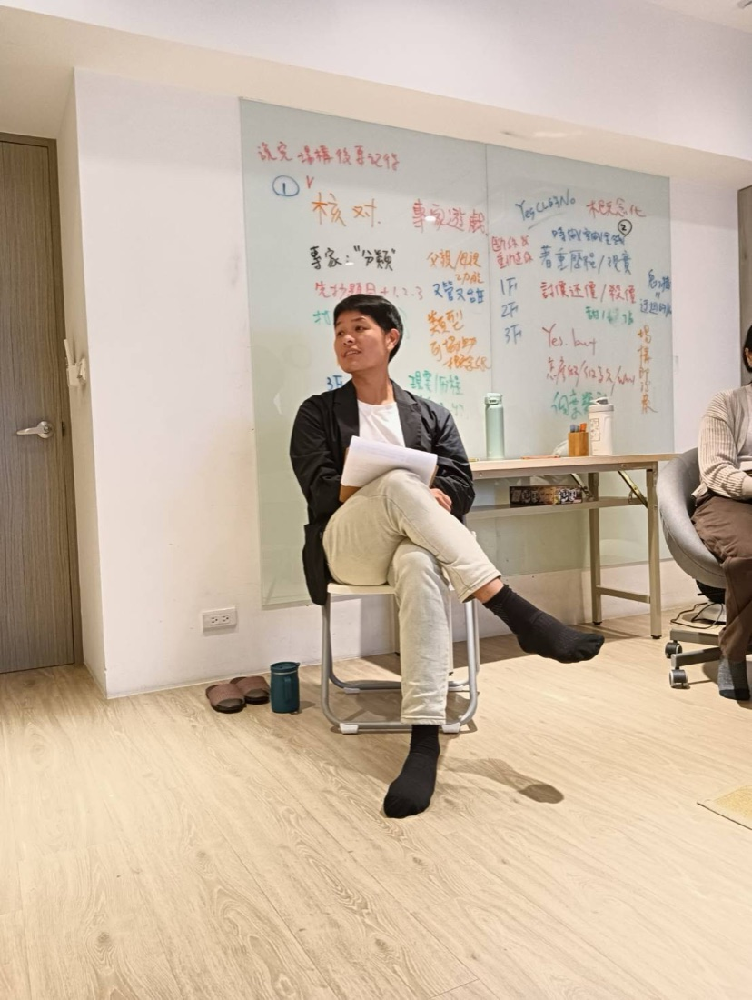

我是**王家齊**，臨床心理師。

一半的時間在台北的[大心診所](https://www.betterhelpgroup.com/)做心理治療，一半的時間做專業訓練。

這兩件事看起來不太一樣，但對我來說是同一件 —— 都在處理「兩個人之間，此刻正在發生什麼」。

## 在診所

專長是**人際溝通分析**與**創傷情緒治療**。

實際接的多半是關係裡走不過去的地方：失戀之後的調適、外遇之後的收拾、伴侶之間反覆卡住的同一場爭吵。也接情緒勒索、職場政治，以及親子之間那些說不出口的。

## 在教室

訓練的目標是讓臨床能力真的長出來，而不是記得更多理論。所以重點不是講，是練 —— 反覆演練、現場回饋，然後再做一次。

累積下來超過 **500 場**應用即興劇工作坊，橫跨學校、醫院與企業。也首創把即興劇應用在心理治療師專業訓練的課程：[《場構進階實作》](https://www.facebook.com/funnyliveshow/posts/1125294489394298)、[《線上整合式實務團督：演練專班》](https://www.facebook.com/funnyliveshow/posts/1171632394760507)。

## 我差點放棄即興劇

我不是一開始就適合這個。

剛開始只是單純享受每週一次的練習。但課程越進階，夥伴越來越厲害，我開始懷疑自己 —— 我會不會拖累大家？我真的適合即興嗎？

有一次我站在教室門口，躊躇了二十分鐘。

一個聲音說：回家吧，反正沒人會注意你沒來。
另一個聲音說：再給自己一次機會，就一次。真的不行，再放棄也不遲。

我推開了那扇門。

多年後，**2015 年，我到加拿大卡加利參加國際即興劇工作坊**。輪到我上場，眾人注視之下，我的腦袋一片空白，一個字都說不出來。

那一刻我以為自己完了。

然後七十多歲的 **Keith Johnstone** 對我舉起雙手，大喊：

> **Again!**

那一聲接住了我。

我突然明白，即興不是逼你表現完美，而是讓你一次又一次地回到當下。

這件事後來成了我做治療的底層 —— 也是[〈Again —— 重來，而不是檢討〉](../posts/again/)那篇文章在講的東西。

## 著作

- [《**教學即興力**》](https://www.books.com.tw/products/0010972240)（商周出版）—— 全台灣第一本把即興劇應用於教育訓練的工具書
- [《**媽寶心理學**》](https://www.chiachipsy.com/2024/01/newbook--psychology-of-man.html)
- [《**把天聊死，不如把愛聊活**》](https://www.books.com.tw/products/0011037393)

後兩本談的是同一件事：**男人為什麼開不了口。** 吵架之後說不清楚自己在想什麼，或者總在壓抑與暴怒之間來回，直到伴侶下了最後通牒才走進諮商室。這個題目我還在寫。

## 專欄與講座

- 《人間福報》[〈**聊聊心裡事**〉](https://www.merit-times.com/news/470425)專欄，2024 年 8 月起每月一篇
- [大大學院](https://www.dada-master.com/teacher/140)講師

### 媒體訪談

- 台北市心衛中心 × 嘟嘟人 The DoDo Men　[【男人的情緒心理學】](https://www.youtube.com/watch?v=OTBTx_XCTTw)
- 台北市心衛中心 × 霸軒　[【男性的心理健康】](https://www.youtube.com/watch?v=dnJiqBoiNu4)
- 白癡公主　[【劈腿、偷吃與外遇的心理學】](https://www.youtube.com/watch?v=_Cb3i-k3YkY)
- 《POP 最正點》林書煒專訪　[【媽寶心理學】](https://www.youtube.com/watch?v=hpwkcEb4aE4)
- 《生活芳程式》王月芳專訪　[【失戀、分手後的自我調適】](https://www.youtube.com/watch?v=zbsw37uhqLE)

## 認證

2025 年取得：

- **Levers of Transfer Effectiveness® Certified Transfer Designer**（學習移轉設計）
- **Accelerated Learning（AL）**加速式學習課程引導師／設計師

## 關於這個網站

這裡是**筆記**，不是課程介紹。

把即興劇的原則放進治療室之後，有些東西值得慢慢寫下來 —— 不是為了推廣，是為了把想法整理清楚。所以這裡的文章比較短、比較個人，也比較願意講那些還沒想通的部分。

課程資訊、完整文章庫與報名管道在我的主要網站：

**[chiachipsy.com](https://www.chiachipsy.com/)**

想知道「這堂課教什麼、什麼時候開」，去那邊。想知道「這個人到底怎麼想」，留在這裡。
